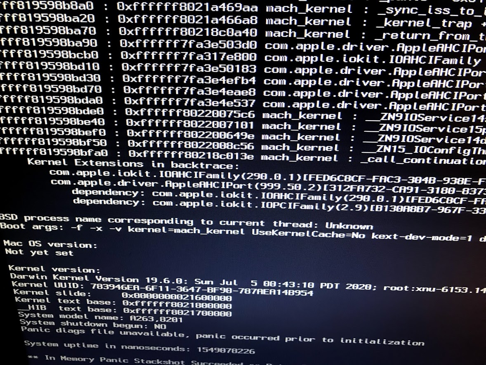

# ASUS P8Z68 - DELUXE Catalina

## Introduction

Bios: Last version 

OPEN CORE 0.6.0 RELEASE efi for ASUS P8Z68 - DELUXE Hackintosh Catalina 10.15.6.

CPU: i7-2600 3.40Ghz (intel: Sundy Bride)
RAM: 12GB DDR3

GEFORCE GTX 770

## Bios

* AI Tweaker > Ai Overclock Tuner > Auto
* AI Tweaker > Turbo Ratio > Auto
* AI Tweaker > Internal PLL Overvoltage > Auto
* AI Tweaker > Memory Frequency > Auto
* AI Tweaker > EPU Power Saving Mode > Disabled
* AI Tweaker > CPU Power Management > CPU Ratio > Auto
* AI Tweaker > CPU Power Management > Enhanced Intel Speedstep Technology > Enabled
* AI Tweaker > CPU Power Management > Turbo Mode > Enabled
* Advanced Settings > CPU Configuration > Active Processor Cores > All
* Advanced Settings > CPU Configuration > Limit CPUID Maximum > Disabled
* Advanced Settings > CPU Configuration > Execute Disable Bit > Enabled
* Advanced Settings > CPU Configuration > Enhanced Intel Speedstep Technology > Enabled
* Advanced Settings > CPU Configuration > Turbo Mode > Enabled
* Advanced Settings > CPU Configuration > CPU C1E > Auto
* Advanced Settings > CPU Configuration > CPU C3 Report > Auto
* Advanced Settings > CPU Configuration > CPU C6 Report > Auto
* Advanced Settings > CPU Configuration > Intel Virtualization Technology > Enabled
* Advanced Settings > PCH Configuration > High Precision Timer > Enabled
* Advanced Settings > SATA Configuration > SATA Mode Selection > AHCI
* Advanced Settings > SATA Configuration > S.M.A.R.T. Status Check > Enabled
* Advanced Settings > System Agent Configuration > Memory Remap Feature > Enabled
* Advanced Settings > System Agent Configuration > Graphics Configuration > Primary Display > Auto
* Advanced Settings > System Agent Configuration > Graphics Configuration > iGPU Memory > 64M
* Advanced Settings > System Agent Configuration > Graphics Configuration > Render Standby > Disabled
* Advanced Settings > System Agent Configuration > Graphics Configuration > iGPU Multi-monitor > Disabled
* Advanced Settings > CPU Configurations > VT-d > Disabled
* Advanced Settings > USB Configuration > Legacy Support > Auto
* Advanced Settings > USB Configuration > Legacy USB 3.0 Support > Enabled
* Advanced Settings > USB Configuration > EHCI Hand-off > Disabled
* Advanced Settings > Onboard Devices Configuration > HD Audio Controller > Enabled
* Advanced Settings > Onboard Devices Configuration > Front Panel Type > HD
* Advanced Settings > Onboard Devices Configuration > SPDIF Out Type > SPDIF
* Advanced Settings > Onboard Devices Configuration > Bluetooth Controller > Enabled
* Advanced Settings > Onboard Devices Configuration > VIA 1394 Controller > Enabled
* Advanced Settings > Onboard Devices Configuration > PCI Express X16_3 slot (black) bandwidth > Auto
* Advanced Settings > Onboard Devices Configuration > Marvell Storage Controller > AHCI Mode
* Advanced Settings > Onboard Devices Configuration > Marvell Storage OPROM > Disabled
* Advanced Settings > Onboard Devices Configuration > JMB Storage Controller > Enabled
* Advanced Settings > Onboard Devices Configuration > JMB Storage OPROM > Enabled
* Advanced Settings > Onboard Devices Configuration > Display OptionRom in POST > Enabled
* Advanced Settings > Onboard Devices Configuration > Asmedia USB 3.0 Controller > Enabled
* Advanced Settings > Onboard Devices Configuration > Asmedia USB 3.0 Battery Charging Support > Disabled
* Advanced Settings > Onboard Devices Configuration > Intel LAN Controller > Enabled
* Advanced Settings > Onboard Devices Configuration > Intel PXE OPROM > Disabled
* Advanced Settings > APM > Restore AC Power Loss > Power Off
* Advanced Settings > APM > Power On By PCI > Disabled
* Advanced Settings > APM > Power On By PCIE > Disabled
* Advanced Settings > APM > Power On By RTC > Disabled
* Monitor > CPU Q-Fan Control > Enabled
* Monitor > Chassis Q-Fan Control > Enabled

## What works

- Keyboard & Trackpad
- Audio ALC892 (can change 4 outputs)
- VGA + HDMI (Dual monitor)
- LAN x2 Internal RealtekRTL8111
- USB 2.0
- USB 3.0 (Inertnal on motherboard) + 2 blue on back 
- USB 3.1 +
- TurboBoost
- GPU Acceleration
- NVMe on AGP port (PCI-e)
- BCM4933 Native working wifi + bt (airdrop)

## What doesn't work

- Bluetooth on motherboard

## Post Install

- With Colover -> write EFI
- Copy files and decor it...
- I put new folder (After install) with other kexts, what I use
- Add SMBIOS, Serials and other stuff

## BIOS

- BIOS update for support NVMe on PCI-e

## After Update to 10.15.6

Probably you have kernel Panic and poker face :P

In message look on line where saying Kernel Extensions in backtrace:
	probably you have com.apple.driver.AppleAHCIPort panic
	
	- reboot
	- Use usb for boot or if EFI working boot recovery partition.
	- Open terminal and go to you install disk
	
	- see your disk partitions
	- ~ df
	- go to kext folder
	- ~ /Volumes/<OSX>/Library/Extensions/
	- ls -l
	- look if you see something like panic message AppleAHCIPortHotplug.kext
	- you can moved it to other folder or delete
	- ~ rm AppleAHCIPortHotplug.kext
	- now you need restore permissions
	- ~ chmod -Rf 766 /Volumes/<OSX>/S*/L*/E*
	- ~ chmod -Rf 766 /Volumes/<OSX>/L*/E*
	- and now rebuild kext cache
	- ~ kextcache -i /Volumes/<OSX>
	- ~ reboot
	
Thats it!
Finally boot normal, and use Hackintool

